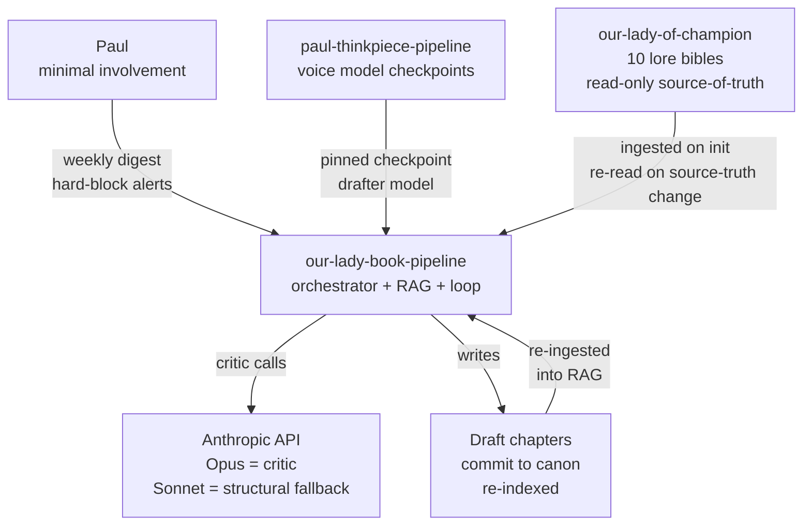
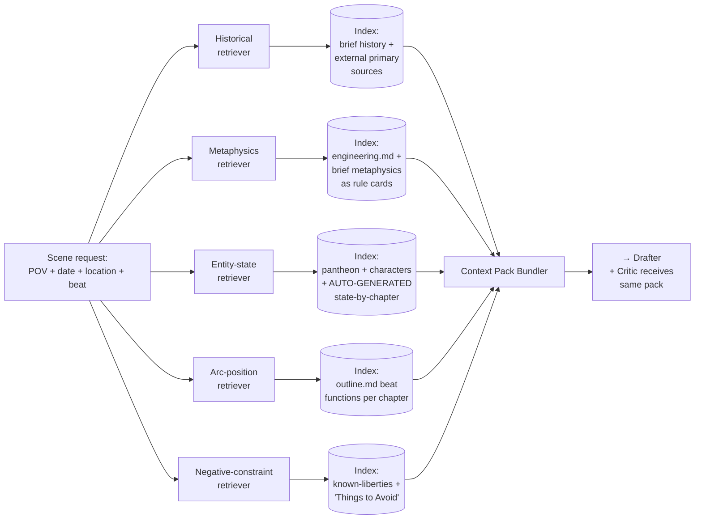

# Our Lady of Champion — Book Pipeline Architecture

**Status:** draft v1 (2026-04-21)
**Authors:** Paul Logan + Claude (exploration session)
**Also serves as:** testbed for future writing pipelines (blog, thinkpiece, short-story). Kernel will be extracted once a second pipeline instance exists.

---

## Purpose

Automate first-draft production of the novel *Our Lady of Champion* with:

1. **Voice fidelity** via fine-tuned local model (checkpoint pinned from `paul-thinkpiece-pipeline`).
2. **Factual consistency** enforced before commit, across 5 axes (historical, metaphysics, entity-continuity, arc-position, thematic don'ts).
3. **Minimal human involvement** — autonomous drafting loop, weekly digests, alerts only on hard-blocks.
4. **Experiment telemetry** — pipeline is a testbed; every run emits structured observations, retrospectives, and closed/open theses.

---

## Key design choices

- **Scene as generation unit, chapter as commit unit.** Scenes (~1000w) are small enough for the voice model to draft cleanly; chapters (~3000w) match the existing outline grain and are the canon unit.
- **Mode dial, not promotion ladder.** Voice-FT drafter is default (Mode A). Frontier drafter is an escape hatch (Mode B) for regen budget blowouts or structurally complex beats. No attempt to have local FT "graduate" to longer units — local FT cannot one-shot >~1000w cleanly, and pretending otherwise just loses voice.
- **Typed RAG, not monolith.** 5 separate retrievers (see below). Each returns structured findings the critic can grade against the rubric axis-by-axis.
- **Observability first-class.** Every LLM call emits structured events. Retrospectives are written per chapter. Theses are the artifact that transfers learnings to other pipelines and back to FT training.
- **openclaw + Claude Code split.** openclaw runs the orchestration (cron, persistent workspace, volume drafting — tokens free). Claude Code / Anthropic API runs the quality-critical reasoning (critic, entity extractor, retrospective synthesis).

---

## Diagram 1 — System context



---

## Diagram 2 — Core drafting loop (per scene)

```
            ┌─────────────────────────────────────────────┐
            │  Scene request from outline beat             │
            │  (POV + date + location + beat function)     │
            └──────────────────┬──────────────────────────┘
                               │
                               ▼
         ┌──────────────────────────────────────────┐
         │  RAG Bundler                              │
         │  query 5 typed retrievers in parallel     │
         │  → context pack                            │
         └──────────────────┬───────────────────────┘
                            │
                            ▼
         ┌──────────────────────────────────────────┐
         │  Mode A Drafter (voice-model FT local)   │
         │  input: beat + RAG pack + prior scenes    │
         │  temp/top_p dialed per scene type         │
         └──────────────────┬───────────────────────┘
                            │
                            ▼
         ┌──────────────────────────────────────────┐
         │  Critic (Opus subagent)                  │
         │  5-axis rubric → structured JSON          │
         │  score per axis + issue list + severity   │
         └──────────────────┬───────────────────────┘
                            │
                     ┌──────┴──────┐
                     │             │
                  PASS           FAIL
                     │             │
                     ▼             ▼
              ┌───────────┐   ┌──────────────────┐
              │ Commit to │   │ Regenerator      │
              │ scene     │   │ issue-conditioned │
              │ buffer    │   │ rewrite, max R   │
              └─────┬─────┘   └────────┬──────────┘
                    │                  │
                    │              still FAIL after R
                    │                  │
                    │                  ▼
                    │          ┌──────────────────┐
                    │          │ Mode B escape    │
                    │          │ (frontier Opus)  │
                    │          └────────┬─────────┘
                    │                   │
                    │               PASS│    FAIL
                    │                   ▼    │
                    │          ┌──────────┐  │
                    │          │ Commit w/│  ▼
                    │          │ mode=B   │ HARD BLOCK
                    │          │ tag      │ → Telegram
                    │          └─────┬────┘
                    │                │
                    └────────────────┤
                                     ▼
                              buffer fills
                                     │
                                     ▼
                        all scenes for chapter K present
                                     │
                                     ▼
                    ┌─────────────────────────────────┐
                    │ Chapter Assembler                │
                    │ stitch scenes, smooth transitions│
                    └─────────────────┬───────────────┘
                                      ▼
                    ┌─────────────────────────────────┐
                    │ Chapter-level critic pass        │
                    │ arc coherence, voice consistency │
                    └─────────────────┬───────────────┘
                                      ▼
                    ┌─────────────────────────────────┐
                    │ Commit to canon/                 │
                    │ re-index RAG                     │
                    │ run entity extractor             │
                    │ run retrospective writer         │
                    └──────────────────────────────────┘
```

---

## Diagram 3 — Typed RAG topology



### Retriever notes

| Retriever | Index source | Update cadence | Query shape |
|---|---|---|---|
| Historical | `our-lady-of-champion-brief.md` historical section + optional external primary sources | Static | Date range + event name |
| Metaphysics | `our-lady-of-champion-engineering.md` + brief metaphysics section, chunked as rule cards | Static | Engine tier + fuel class |
| Entity-state | `pantheon.md`, `secondary-characters.md`, auto-generated entity cards per-chapter | Post-commit per chapter | Entity name → current state at chapter K |
| Arc-position | `outline.md` beat functions | Static | Chapter number → beat + POV + surrounding beats |
| Negative-constraint | `known-liberties.md` + brief "Things to Avoid" | Static | Topic tag (e.g., "Malintzin", "sacrifice depiction") |

**Critical insight:** entity-state index is **auto-generated** from committed chapters. After chapter K commits, an extractor agent pulls entity facts ("Andrés is at location Y after Centla, has killed N people, possesses copper disc from Tlaxcalan pilot") and writes structured cards. Chapter K+1 drafter sees this, cannot contradict.

---

## Diagram 4 — Mode dial (voice ↔ frontier)

```
┌──────────────────────────────────────────────────────────────┐
│ Mode A (default): VOICE                                       │
│   Drafter  = FT local (thinkpiece checkpoint, pinned)         │
│   Unit     = scene (~1000w)                                   │
│   Assembly = 2-4 scenes stitched into chapter                 │
│   Critic   = Opus (structured rubric)                         │
│   Regen    = voice model, issue-conditioned                   │
│   Escape   → Mode B after R voice-regen fails OR flagged beat │
└──────────────────────────────────────────────────────────────┘
┌──────────────────────────────────────────────────────────────┐
│ Mode B (escape hatch): FRONTIER                               │
│   Drafter  = Claude Opus w/ voice samples in-context          │
│   Unit     = scene OR chapter (opt-in per call)               │
│   When     = Mode A budget blown, structurally complex beats  │
│              (apex awakening, climactic martyrdom, reveal)    │
│   Cost     = tracked, flagged in digest                       │
│   Voice    = best-effort via prompt, lossy                    │
└──────────────────────────────────────────────────────────────┘
```

**Beats flagged Mode-B from the start** (tentative, revisit after first pass):

- Ch 10 (Cholula Quetzalcoatl stirring) — apex engine staging
- Ch 17-18 (two-thirds revelation) — multi-POV convergence, dense theological argument
- Ch 25-27 (Tenochtitlan siege, Franciscan martyrdom, Great Engine waking) — climactic structural load

These can be demoted to Mode A once voice-model capability on similar material is measured.

---

## Diagram 5 — Runtime layout (openclaw + Claude Code)

```
┌─────────────────────────────────────────────────────────────────┐
│  DGX Spark GB10 (this machine)                                   │
│                                                                  │
│  ┌─────────────────────────┐    ┌────────────────────────────┐ │
│  │ openclaw gateway        │    │ paul-thinkpiece-pipeline    │ │
│  │ (systemd --user)        │    │ venv_cu130                   │ │
│  │ cron-driven             │    │ voice-model FT checkpoints   │ │
│  └──────────┬──────────────┘    └────────────────────────────┘ │
│             │                               ▲                    │
│             │ spawn                         │ pin checkpoint     │
│             ▼                               │                    │
│  ┌─────────────────────────────────────────┴──────────────────┐ │
│  │ book-pipeline openclaw workspace                             │ │
│  │  ├─ drafter agent   (loads voice FT via vLLM local)         │ │
│  │  ├─ critic agent    (calls Anthropic Opus API)              │ │
│  │  ├─ regenerator     (voice FT + issue conditioning)         │ │
│  │  ├─ rag service     (Python, 5 retrievers, pgvector/lance)  │ │
│  │  ├─ entity extractor (Opus, runs post-commit)               │ │
│  │  └─ promotion ctrl   (state machine, json on disk)          │ │
│  └───────────────────────────────────────────────────────────┬─┘ │
│                                                              │    │
│  ┌───────────────────────────────────────────────────────────▼─┐ │
│  │ our-lady-book-pipeline/                                      │ │
│  │  ├─ canon/        (committed chapters)                       │ │
│  │  ├─ drafts/       (in-flight, pre-commit)                    │ │
│  │  ├─ indexes/      (5 RAG vector stores)                      │ │
│  │  ├─ entity-state/ (auto-generated cards per chapter)         │ │
│  │  ├─ runs/         (openclaw run logs, critic reports)        │ │
│  │  ├─ theses/       (open + closed experiments)                │ │
│  │  ├─ retrospectives/ (post-chapter notes)                     │ │
│  │  └─ digests/      (weekly human-facing summaries)            │ │
│  └──────────────────────────────────────────────────────────────┘ │
└─────────────────────────────────────────────────────────────────┘

Human surface:
 • cron: nightly run at 02:00, digest generated 07:00
 • alerts: hard-block → Telegram (existing channel) or email
 • review: Paul reads digest weekly, spot-checks canon/
```

---

## Components table

| Component | Tech | Role | Notes |
|---|---|---|---|
| **Voice drafter** | FT local (cu130 infra, vLLM serve) | Mode-A scene generation | Checkpoint pinned via `config/voice_pin.yaml`. Upgrades are deliberate. |
| **Frontier drafter** | Anthropic API (Opus or Sonnet) | Mode-B scene/chapter generation | Used on flagged beats + when Mode A regen budget exceeded. |
| **Critic** | Anthropic API (Opus) | 5-axis rubric scoring | Structured JSON output. Rubric in `config/rubric.yaml`. |
| **Regenerator** | voice FT + issue conditioning | Targeted rewrite | Takes critic issue list as input, rewrites only affected passages where possible. |
| **RAG retrievers** | Python + pgvector or lancedb | 5 typed indexes | Config in `config/rag_retrievers.yaml`. |
| **Entity state tracker** | Opus subagent, scheduled post-commit | Auto-build entity cards per chapter | Output in `entity-state/chapter_NN/*.md`. |
| **Chapter assembler** | deterministic Python + optional frontier smoother | Stitch scenes into chapter | Handles transitions, voice consistency pass. |
| **Retrospective writer** | Opus subagent, post-chapter-commit | "what worked / didn't / why" notes | `retrospectives/chapter_NN.md`. |
| **Thesis matcher** | Python script + Opus | Map new retrospectives against open theses | Closes or updates theses automatically. |
| **Promotion controller** | state-machine in Python | Tracks mode + regen budget + streaks | `runs/state.json`. |
| **Orchestrator** | openclaw (cron-driven) | Nightly runs, retry, persistence | `.openclaw/` workspace within repo. |
| **Observability** | JSONL event log + metric ledger | Every LLM call emitted | `runs/events.jsonl`. |
| **Digest generator** | Python + Opus | Weekly markdown summary | `digests/week_YYYY-WW.md`. |

---

## Testbed framing (why this pipeline is over-instrumented)

This is pipeline #1 of a family. Every shortcut taken now is a learning lost for pipeline #2 (blog), #3 (thinkpiece), #4 (short-story). Therefore:

- **Every LLM call** emits a structured event (prompt, model, temp, tokens, latency, role, caller).
- **Every critic score** is persisted per-axis, not collapsed to pass/fail.
- **Every regen** records which issue(s) triggered it and whether the rewrite resolved them.
- **Every Mode-B escape** is an explicit observation, not a silent fallback.
- **Retrospectives** are LLM-written observations, not just metrics — patterns that metrics can't see.
- **Theses** are the transferable unit. A thesis closed here becomes a pre-baked assumption for pipeline #2.

See `docs/ADRs/003-testbed-framing.md` for rationale.

---

## Open questions (become first theses)

1. Does thinkpiece-voice FT model (trained on Paul's essay/blog prose) transfer acceptably to historical-fiction prose? Prediction: partially. Diction and register transfer; scene staging and dialogue do not.
2. What's the Mode-B escape rate for the first 9 chapters? Prediction: 20-30%, concentrated on battle staging and apex-engine scenes.
3. Does per-axis critic scoring capture human perception of quality better than a monolith score? Prediction: yes, but only if axes are calibrated to 5-6 concrete issues each.
4. Is entity-state auto-extraction good enough to catch continuity errors (e.g., copper disc from Ch 5 referenced in Ch 12)? Prediction: yes for explicit facts, no for implicit state changes (e.g., character's shifted belief).
5. How much of the corpus (10 bibles, ~250KB) usefully fits in one retrieval context? Prediction: all of it fits, but the relevance signal degrades past ~30-40KB of context, argues for aggressive filtering in retrievers.

These seed `theses/` as open experiments.

---

## Non-goals (explicitly out of scope v1)

- Cover art, marketing copy, pitch letters, query letters.
- Final line-editing pass for publication (pipeline produces drafts, not publication-ready manuscripts).
- Real-time collaborative editing with Paul (async digest review model is the surface).
- Model training — that's `paul-thinkpiece-pipeline`. Book pipeline *consumes* checkpoints, doesn't produce them.
- Kernel extraction — deferred until pipeline #2 exists (see ADR-004).
