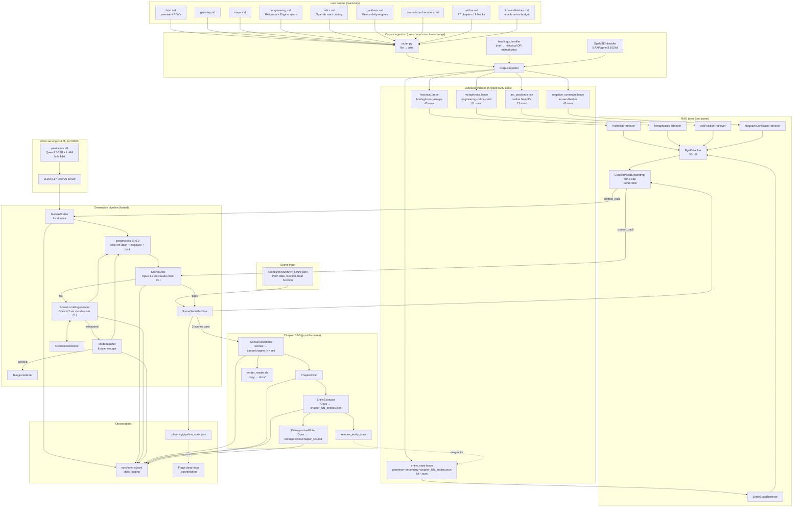

# Pipeline architecture

End-to-end flow for one scene generation, plus the chapter DAG that runs after each chapter ships.

## Component map

## Stage-by-stage data contracts

| Stage | Input | Output | Backend |
|---|---|---|---|
| **Ingest** | 9 lore .md files | 5 LanceDB tables (217 rows total) | BGE-M3 local |
| **Retrievers** | SceneRequest | 5 axis-typed RetrievalHit lists | LanceDB ANN + filter |
| **Reranker** | candidate_k=50 | final_k=8 | BAAI/bge-reranker-v2-m3 |
| **Bundler** | 5 hit lists | ContextPack (≤40KB, round-robin) | pure Python |
| **ModeADrafter** | ContextPack + scene stub | scene_text (~600-800 words) | vLLM paul-voice |
| **postprocess** | raw scene_text | cleaned scene_text | Forge v1.0.0 contract |
| **SceneCritic** | scene_text + ContextPack + rubric | per-axis scores + overall pass | Opus 4.7 (CLI) |
| **SceneLocalRegenerator** | failed scene + critic feedback + ContextPack | regenerated scene_text | Opus 4.7 (CLI) |
| **ModeBDrafter** | ContextPack | new scene_text | Opus 4.7 (CLI) |
| **ChapterCritic** | concatenated scenes | per-axis chapter scores | Opus 4.7 (CLI) |
| **EntityExtractor** | concatenated chapter | EntityCard JSON | Opus 4.7 (CLI) |
| **reindex_entity_state** | chapter_NN_entities.json | entity_state.lance rows | BGE-M3 local |
| **RetrospectiveWriter** | scene buffer + critic logs + entities | retrospective markdown | Opus 4.7 (CLI) |

## Critical observations

1. **Drafter sees the lore.** The `context_pack` parameter threads through every LLM call. If the pack is empty, the LLM hallucinates; if rich, it's grounded.
2. **The mecha bible lives in `metaphysics.lance`** (engineering.md + relics.md + brief.md sanctified-death sections). 51 rows after 2026-04-24 ingest.
3. **Negative-constraint** carries the explicit "core liberty: mecha" tag. Drafter sees this — anachronism is feature, not bug.
4. **entity_state is a UNION** of static lore (pantheon + secondary characters) and dynamic per-chapter extracted state. The `reindex_entity_state_from_jsons` helper currently wipes-and-rebuilds from per-chapter JSON only — it would nuke pantheon/secondary rows. **OPEN BUG: the helper must filter `source_file` on delete to preserve corpus rows.**
5. **Chapter DAG step 3 calls reindex_entity_state** — runs after each chapter. This means after first DAG, pantheon entities go missing again until re-ingest. See remediation.

## Boundaries (kernel vs CLI vs book-specific)

- **kernel:** corpus_ingest, rag, drafter, critic, regenerator, chapter_assembler, retrospective, entity_extractor, voice_fidelity, observability, llm_clients, alerts, ablation
- **book_specifics:** corpus_paths, heading_classifier, voice_samples, training_corpus, anchor_sources, outline_scene_counts, nahuatl_entities, vllm_endpoints
- **CLI composition root:** cli/draft.py, cli/chapter.py, cli/ingest.py — only modules permitted to import book_specifics

import-linter contracts 1+2 enforce the boundary.
