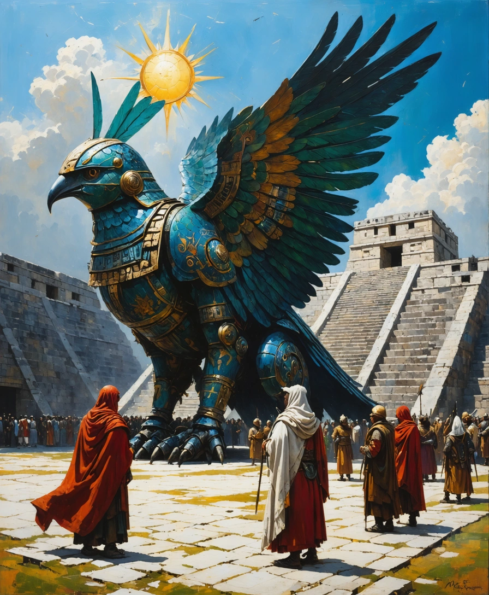

<!-- chapter-hero-injected -->

 <em style="font-size:0.9em;color:#666">A Huitzilopochtli engine at the Templo Mayor</em>

<!-- chapter-hero-injected -->

<!-- scene: ch10_sc01 -->
The Spanish were quartered in the palace of Axayacatl, Moctezuma's father. A great sprawling complex, courtyards linked by arched corridors, stuccoed walls painted with murals of gods and warriors and kings, fountains drawing clean lake-water at the center of each space. The smell of copal followed Andrés everywhere he walked. It did not bother him.

He had been in Tenochtitlan for a day. The city was cleaner than Seville. Twice as large. The market at Tlatelolco had been a revelation, fruit he had never seen, cacao beans that tasted of chocolate, copper bells, obsidian mirrors, a bird in a cage singing in a language that sounded like no other language he had ever heard. The canals. The bridges. The causeways, one of them visible through the palace walls, stone and wood and earth rising from the lake like the spine of a giant fish. The Templo Mayor at dusk, its shadow lengthening across half the precinct. The Great Engine at its heart, humming, the sound so faint Andrés thought he was imagining it, but then he heard it again.

He did not sleep that night. He lay in the cot assigned him, staring at the ceiling. He could see the Templo Mayor through a high window, its silhouette against the stars. He imagined the Great Engine inside. Its scale. Its power. *Santiago del Paso*, the expedition's minor first-class, a finger bone of a lesser Reconquista saint, a 210-foot machine of iron and faith, was their apex deterrent. The largest engine they had walked into the valley with. It would not last a minute against what lived in that pyramid.

The Mexica had engines too. They had to. The Spanish had not been the ones to invent war machines. The Mexica had been building them, refining them, fighting with them for centuries. The Spanish were latecomers. The Mexica were the masters.

In the morning he walked through the palace, slowly, letting his eyes take in the space. High walls. Fountains. Murals. The smell of copal, and beneath it the wetter smell of the lake. The engines stood in the outer courtyard, their cradles improvised from Mexica scaffold-stone, their shrines half-built, their standards hanging limply in the still air. *La Niña de Córdoba* stood beside *Santiago del Paso*. Andrés had never stood next to *Santiago del Paso* before. He was awed by it. He was ashamed of being awed. Because what *Santiago del Paso* would not survive a minute against, the Great Engine of the Templo Mayor, loomed over the palace wall in plain sight, its steps bone-white at this hour, its twin shrines visible even from here.

He looked at it for a long time. Then he looked back at *Santiago del Paso*, minor first-class, finger-bone, the line they would hold if anything held. Then he looked at *La Niña*. She was so small. She was so far from home.

Further down the courtyard the Tlaxcalan auxiliaries were stretching their cordage. Two of their engines stood among the Spanish ones, banded in red and white, their cradles set lower than the Reconquista chassis required. The Tlaxcalan teōmachtianime moved among them with the patience of men who had done this many mornings in a row. They had walked into the city with the column three days ago and would not be leaving. Cortés had refused to leave them at the causeway-foot, and the Mexica had refused, in their courtesy, to refuse him. It was the kind of refusal that meant something else.

Andrés watched a Tlaxcalan pilot wipe down a greave-plate with a folded cloth. The man saw him watching and did not look away. He did not nod, either. He returned to the cloth.

Bernardo was in the chapel.

Andrés knew this without going in. The chapel had been a small private oratory of Moctezuma's, a domed room off the western corridor, and Bernardo had asked the captains for it as soon as they arrived. He spent his hours there now. He prayed. He read his small Latin breviary, the one with the stitched binding. He had not yet asked anyone what the murals on the chapel walls had meant before they were whitewashed for him.

Andrés did not go to the chapel.

He stood in the courtyard instead, between the Spanish engines and the Tlaxcalan engines, with the Great Engine humming behind the precinct wall. He tried to count the courses of stone in the Templo Mayor's lower terrace and lost count at thirty-eight. The pyramid was nearer to sixty meters than fifty. He had paced the base yesterday at almost five hundred Castilian feet. It was taller than the cathedral at Seville and broader than the cathedral at Seville and it was only the *housing* of the thing that hummed beneath it.

A captain passed and clapped him on the shoulder and said something, *good morning, son*, or *don't stare too long*. Andrés afterward could not remember which. He nodded and did not answer.

He thought of *Santiago del Paso*. Their apex deterrent. A minor first-class. A finger bone of a saint whose name only three priests in Castile still remembered, and one of them was Bernardo.

He thought of *La Niña*, the splinter of Saint Flora at her heart, and how she had inclined her shoulders for him on the road to Cempoala, six, eight inches, no more, but enough.

He thought of the Great Engine.

He went back inside, because he could not stand in the courtyard any longer, and because he did not yet trust himself to walk further into the precinct alone. He passed the chapel door. He heard Bernardo's voice through it, low, in Latin, the rhythm of the morning office. He did not go in.

He returned to his cot. He did not lie down. He sat on its edge and looked at his hands. They were shaking, very slightly. He had not noticed.

He had been in Tenochtitlan for a day and a half.

He understood, slowly, that whatever he was being asked to do here, *Santiago del Paso* would not be enough, and *La Niña* would not be enough, and Bernardo's prayers would not be enough, and the only thing that might be enough was something he had not yet been told the name of.

He closed his eyes. He tried to sleep. He did not.

---

<!-- scene: ch10_sc02 -->
Andrés walked through the Tlatelolco market. He was escorted by two Tlaxcalan warriors, the same ones who had walked beside him in the palace, and a Mexica protocol officer who seemed to be translating between the three groups of Nahuatl being spoken and the one group of Spanish. He did not understand what they were saying. He was not supposed to. He was just walking.

It was not like the markets in Seville. The smell was different, and the rhythm. The market was cleaner than the markets in Seville. The food stalls had no open waste. The fruit vendors had their produce arranged in patterns, not piles. The water was clean. The canals ran through the market and people stepped off boats onto the same stone walkways as the pedestrians. The buildings were stuccoed, painted, and some had murals of gods and warriors. The air smelled of copal, of roasting cocoa, of something that was either cinnamon or something like it.

Three-stall vendors:

* Feathers. Iguana, macaw, quetzal, heron, owl. Some were alive in cages. Some were dyed. Some were arranged into shapes he did not know.
* Jade. Earrings, bracelets, necklaces. Some were carved with glyphs. Some were set with turquoise. The turquoise was not like Spanish turquoise. It was inlay, not surface decoration.
* Obsidian. Mirrors. Blades. A mirror the size of his palm that showed his reflection in reverse. A blade that seemed to have no edge.
* Dried fish. He knew this. He bought none.
* Cocoa. Dried beans. Chocolate. A cup he drank and did not like, too bitter. A cup he drank and did not like, too sweet.
* Fabric. Cotton, wool, woven and dyed in patterns that repeated but did not repeat, and one that seemed to move when he looked at it.
* Jewelry. Gold. Turquoise. Obsidian. Something else that was not metal and not stone, which he took to be jade.
* Pottery. Bowls and jars and cups, some painted with the same glyphs as the jade, and some that looked like they were made of bone, though they were not.
* Paper. The kind that smelled like bark. The kind that was painted with glyphs. The kind that looked like skin.
* Medicine. Dried leaves. Ground roots. Powders.
* Bread. Flatbread. Tortillas. He had eaten tortillas already and liked them.
* Beer. Chicha. Pulque. He had not drunk them yet.
* Salt.
* Rubber. Balls. Sandal soles. He bought a ball. He bought sandals. He was not allowed to buy anything else.

The Tlaxcalan warriors did not let him stop. They were patient but firm. They were not guarding him. They were guarding him from buying things. The Mexica officer seemed to be negotiating with the vendors and with the Tlaxcalans and with the Spanish captains who had sent him, and with the vendors' vendors. He had no idea what any of them were saying. He was just walking.

He bought nothing. He was recording.

He walked through Tlatelolco. He walked through the canals. He walked through the bridges. He walked through the causeways, one of them visible through the palace walls, stone and wood and earth rising from the lake like the spine of a giant fish. He saw the Templo Mayor's shadow at dusk, lengthening across half the precinct. He saw the Great Engine for the first time and did not sleep that night. Their expedition minor first-class (*Santiago del Paso*, a finger bone of a lesser Reconquista saint, their apex deterrent) would not last a minute against what lived in that pyramid.

He had come here to convert a continent. He was not sure anymore that he was going to convert a continent. The continent that he was walking through had more cities than Castile. It had a market that any Spanish town would envy. He had come here with a conviction. He was not sure anymore that he had a conviction.

He thought of Flora's *vita* and could not remember which courtyard she played in.

He tried to pray.

He did not.

He returned to the palace. He returned to the courtyard where the engines stood. He returned to the courtyard where the Tlaxcalan engines stood. He returned to the chapel where Bernardo was. He did not go inside. He stood outside the door and heard the rhythm of the morning office, the rhythm of the morning office, the rhythm of the morning office.

He thought of the Great Engine.

He thought of *Santiago del Paso*.

He thought of *La Niña*.

He thought of *Flora*.

He did not pray.

He went back to his cot.

He did not lie down.

He sat on its edge and looked at his hands.

They were shaking, very slightly.

He had not noticed.

He had been in Tenochtitlan for a day and a half.

He understood, slowly, that whatever he was being asked to do here, *Santiago del Paso* would not be enough, and *La Niña* would not be enough, and Bernardo's prayers would not be enough, and the only thing that might be enough was something he had not yet been told the name of.

He closed his eyes.

He tried to sleep.

He did not.

He heard the Great Engine humming.

He did not sleep that night.

He did not sleep the next night.

He did not sleep the next night either.

He was tired.

He was not tired.

He was tired and not tired.

He did not know which he was.

He did not know what he was.

He did not know what he was going to do.

He did not know what he was going to pray.

He did not know what he was going to believe.

He thought of Flora's *vita* and could not remember which courtyard she played in.

He tried to pray.

He did not.

He went to the courtyard.

He went to the palace.

He went to the market.

He went to the causeway.

He went to the lake.

He went to the canals.

He went to the bridges.

He went to the Templo Mayor.

He went to the Great Engine.

He went to *Santiago del Paso*.

He went to *La Niña*.

He went to Bernardo.

He went to his cot.

He did not go anywhere.

He went to his cot.

He did not go anywhere.

---

<!-- scene: ch10_sc03 -->
The escort kept six paces back, four men, half-armed, instructed to look at the canals and not at him. Andrés had asked Cortés for the hour alone and Cortés had said no, and then yes, and then this. Six paces. He could feel them like a second heartbeat behind his own.

He walked east from Axayacatl's palace at the hour the city turned amber. The street ran beside a canal three meters wide and the canal ran straight as a Roman road and the canoes moved on it without colliding, without shouting, without the permanent quarrel that was Seville's river-traffic. A boy of perhaps ten paddled past with a load of squash. He glanced at Andrés and did not stare. Andrés had been stared at since Veracruz. The not-staring was harder.

The market at Tlatelolco lay behind him to the north, he had walked it that morning, four hours, and not seen a fifth of it. Twenty-five thousand people, Malintzin had said. Sixty thousand on a feast day. He had counted the kinds of fish at one stall and stopped at fourteen. He had counted the colors of woven cloth at another and stopped at twenty. The smell of the market had been the smell of a city that swept itself: copal, charcoal, wet stone, fruit, no shit. Seville smelled of shit always. He had thought, walking the Tlatelolco aisles, that the friars who came after them would have to be told this and would not believe it.

He passed a household midden and a man with a long-handled scoop loading the night-soil into a flat boat. The boat went west, toward the chinampas. Even the waste here had a destination.

The canal turned. He turned with it. The Templo Mayor's western face came into view across a low wall, perhaps three hundred meters off, the twin shrines at the summit, Huitzilopochtli on the south flank in red, Tlaloc on the north in blue, and the great stairs running down between them. Sixty meters of stepped pyramid. Taller than the nave of any cathedral in Castile. The mosque-cathedral at Córdoba, where Flora's bones had been kept for six centuries before they were divided, would have stood to the third terrace and stopped.

He had been told, on the causeway, that the Templo Mayor was the Engine. He had not understood what was meant. He understood now, the steps were not steps, they were the startup ladder; the shrines were not shrines, they were the ignition crowns; the platform between them was a pilot's deck. Whatever lived inside that pyramid did not need to walk. To deploy it was to dismantle the city it stood in.

He stopped at the wall.

Two priests in black robes, hair lacquered with what he had been told was blood, were crossing the precinct's outer plaza on some errand he could not parse. They saw him. Neither slowed. Neither looked again. The not-looking was deliberate. He understood it the way he understood the boy with the squash. He was being permitted to be there. He was not being acknowledged.

The sun went lower. The shoulder-plates of the Engine, copper, he thought, beaten thin over something else, caught the light and held it for the length of a breath and let it go. The plates were perhaps ninety meters above the plaza floor. They moved. Not walked. Settled. The way a sleeping animal will adjust itself in deep sleep without waking. The pyramid groaned, once, low, the kind of sound a ship's hull makes against its mooring on a falling tide. The two priests on the plaza did not flinch. Andrés had grown up beside the bell of San Hipólito and had learned at six which sounds in a city were the city talking and which were a warning. This was the city talking.

He had piloted *La Niña de Córdoba* for two years. Fifty feet. Second-class. Flora's finger and tooth and small rib in a glass box on the chest plate. He had felt her wake in his hands the first time and had wept for an hour afterward and the older adorators had told him this was normal and would pass, and it had not passed. He had heard, since the causeway four days ago, the Templo Mayor's hum the way a man hears the sea from a town two miles inland, not loud, but everywhere, under everything, the floor of the air. He had not, until this moment, looked up and seen the scale.

*Santiago del Paso*, the expedition's apex deterrent, a minor first-class with a finger bone of some Reconquista saint whose name Andrés could not now produce, three hundred feet on the field, the entirety of what Castile had been willing to send across the ocean, could not have scratched the ankle plate of the thing in front of him. He worked the comparison through twice to be sure. It came out the same.

He stood at the wall until the sun was gone and the shoulder-plates were the color of cooled iron. The two priests had finished whatever they were doing and had vanished into one of the lower temples. The escort behind him had not spoken once. He turned back.

He walked west along the canal he had come up. The canoes were lit now, small clay lamps at the prow. The city did not get darker the way Seville got darker. Lamps came on at the sluice-gates, at the boat-houses, at the corners where the calpulli wards met. By the time he reached the gate of Axayacatl's palace there were perhaps five hundred small fires burning along the canal-grid behind him and not one of them had been lit by a Spaniard.

He passed the courtyard sentries. He did not eat. He went to the room he had been given, a chamber on the upper floor, a window onto the eastern garden, a brazier already lit, and he closed the door and he set his sword belt down and he sat on the cot and he did not move for an hour.

Then he knelt on the stone.

He spoke the *vita* of Flora as he had spoken it every night for eight years. The girl in the courtyard at Córdoba in the year 851. The Mozarabic streets. The two sisters refusing to recant. The sentence under the emir. The blade. He named her age. He named the day. He named the place where her bones had been kept before they were divided. He asked her, in the Latin he had learned at fifteen and the Castilian he had learned at the breast, what he was supposed to do with what he had seen tonight.

Flora had begun to speak to him in dreams on the road from Cholula. Single sentences. No more than that, yet. He had not told the other adorators. He had not told the Franciscan. He had told no one. He had begun to need her voice the way a man needs water, and he had begun to suspect, in the part of himself that had read the manuals and knew what *unio martyrum* was and knew that he was seventeen years too young for it, that needing her voice that way was not safe.

He waited.

The brazier ticked. The wind came through the eastern window and brought the smell of copal off the precinct and the smell of the lake and, very faintly, the smell of something burning that was not wood. He listened the way he had listened on the wall.

Nothing.

He waited longer. He said her name aloud, *Flora*, the way he had said it at dawn on the Cempoala road, which was the first time he had said it where another human being could hear. He said it again. He said the small private name he had given her at sixteen, which was nobody's business but his and hers.

She did not answer.

He stayed on his knees until the brazier went out. Then he lay down on the cot in his clothes and watched the square of the window go from black to gray to a paler gray, and he understood, without wanting to understand, without permitting himself the word for it, that what he had seen at sunset had been seen also by her, and that her silence was not absence. It was counsel. She was telling him to be afraid.

He got up at dawn. He went to find Cortés.

<!-- chapter-nav-injected -->

---

[← Chapter 9](chapter_09.md) · [Index](../index.md) · [Chapter 11 →](chapter_11.md)

<form class="reader-feedback" data-page-id="Chapter 10" onsubmit="return submitReaderFeedback(event)">
  

    
💬 Send anonymous feedback on this page

    <input type="hidden" name="chapter" value="Chapter 10">
    <label>Kind:
      <select name="kind">
        <option>praise / what worked</option>
        <option>critique / what did not work</option>
        <option>factual or continuity error</option>
        <option>voice / prose suggestion</option>
        <option>bug or site issue</option>
        <option>other</option>
      </select>
    </label> 
    <label>What you want to say: 
      <textarea name="body" rows="6" cols="60" required></textarea>
    </label> 
    <label>Optional contact (leave blank to stay anonymous):
      <input type="text" name="contact" maxlength="200">
    </label> 
    <button type="submit">Submit</button>
    
  

</form>


